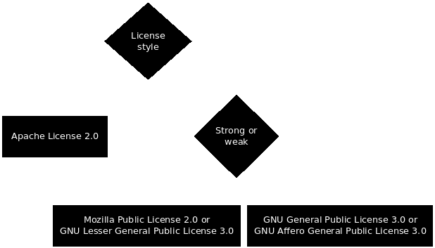

## Things to consider
- Is this code?
- Permissive or Copyleft
- Patents or not
- Legal aspects

## Is this code?
- We only talk about licenses for software.
- These licenses are specifically written for software
- Creative Commons

## License style
:::::::::::::: {.columns}
::: {.column width="45%"}
### Permissive
- Allows relicensing
- Can make proprietary derived works
- Allows flow in any direction
:::
::: {.column width="45%"}
### Copyleft
- Can't relicense
- Share alike
- Weak copyleft
:::
::::::::::::::

## Patents & Legal aspects
- Do you care about patents?
    - You should!
- Legal aspects
    - Talk to your company's lawyer
    - License policy
    - Predictability

## What to choose
Always use a patent license!

{ width=60% }

## Links
- [https://choosealicense.com](https://choosealicense.com/)
- [https://www.gnu.org/licenses/license-recommendations.html](https://www.gnu.org/licenses/license-recommendations.html)
- [https://creativecommons.org/choose/](https://creativecommons.org/choose/)

- [https://en.wikipedia.org/wiki/Mozilla_software_rebranded_by_Debian](https://en.wikipedia.org/wiki/Mozilla_software_rebranded_by_Debian)
