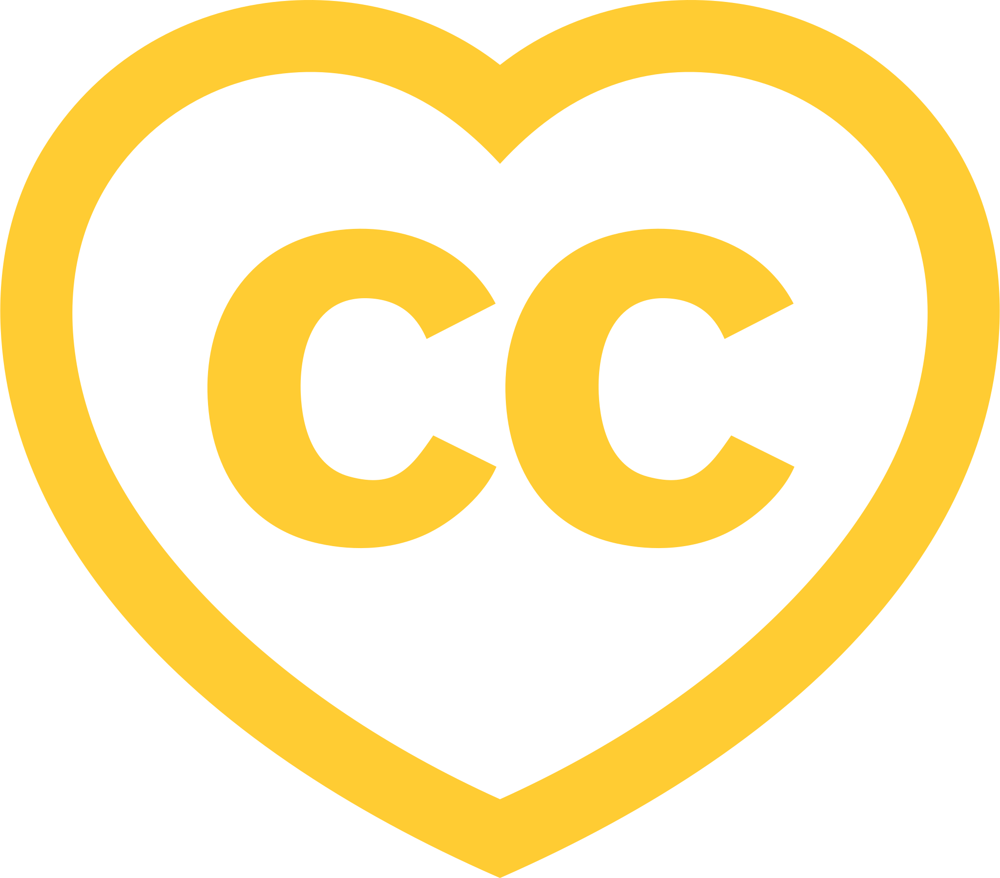
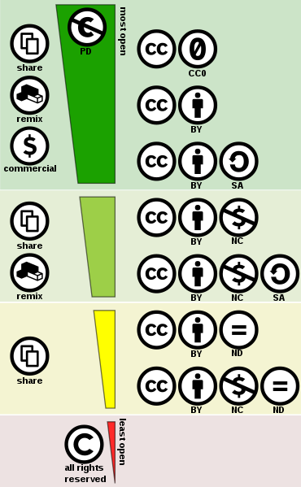
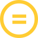
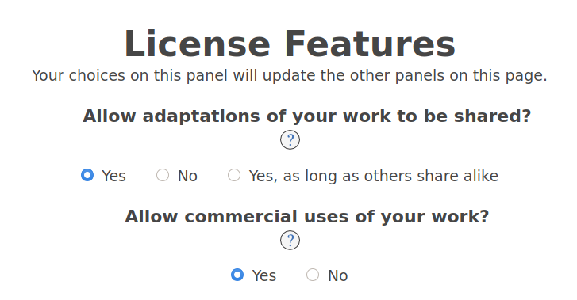

{ height=70% }

# What problem does it solve?
- When artwork is created it's automatically under the authors copyright
- Copyright enables the author to say who can do what with their artwork
- Instead granting rights to every user seperately they can use a Creative Commons license for their artwork
- This way everyone knows how they are allowed to use the artwork
- The license may not be revoked, anyone who receives it may relay on it, even if the author stops distributing it

# What do people license under Creative Commons?
- Educational Material
- Arts / Culture
- Books
- Photos
- Music
- Videos
- Tools
- 3D Models
- Scientific Research
- Government Open Data
- Other (mostly digital) creative works

# History
- The organization was founded in 2001 by Lawrence Lessig, Hal Abelson, and Eric Eldred[^org]
  - Aaron Swartz was one of the early architects of Creative Commons
- The first set of copyright licenses was released in December 2002
- As of today, there are 1.6 billion works licensed under the various Creative Commons licenses
- Flickr alone hosts over 415 million Creative Commons-licensed photos

[^org]: https://web.archive.org/web/20111007165253/http://creativecommons.org/about/history

## Founders

\begin{figure}[hbt!]
 \centering
 \includegraphics[height=5cm]{people.jpg}
 \caption{Abelson, Lessig, Eldred, Schwartz}
\end{figure}

# Creative commons license spectrum

--- 

::: columns
:::: column
Creative commons license spectrum

- public domain (top) 
- all rights reserved (bottom)
- left side indicates the use-cases allowed
- right side the license components
- dark green area indicates Free Cultural Works compatible licenses
- the two green areas compatibility with the Remix culture
::::
:::: column
{height=75%}
::::
:::

## What do the symbols mean?
{width=15%}
{width=15%}
{width=15%}
{width=15%}
{width=15%}
{width=15%}
{width=15%}
{width=15%}
{width=15%}
{width=15%}
{width=15%}

Let's go through them[^licenses] ...

[^licenses]: https://creativecommons.org/licenses/

## CC - Creative Commons

{width=15%}

This is the Creative Commons logo.

You can use it to indicate that you're licensing your artwork under one of
the Creative Commons licenses. To signify which one of the licenses you want to use, you
combine it with one or more of the other logos.

## CC BY - Attribution

{width=15%}
{width=15%}

This license lets others distribute, remix, adapt, and build upon your work, even commercially,
as long as they credit you for the original creation. This is the most accommodating of licenses
offered. Recommended for maximum dissemination and use of licensed materials.

## CC BY-SA - Attribution-ShareAlike 

{width=15%}
{width=15%}
{width=15%}

This license lets others remix, adapt, and build upon your work even for commercial purposes,
as long as they credit you and license their new creations under the identical terms.

This license is often compared to “copyleft” free and open source software licenses. All new
works based on yours will carry the same license, so any derivatives will also allow commercial
use.

## CC BY-ND - Attribution-NoDerivs 

{width=15%}
{width=15%}
{width=15%}

This license lets others reuse the work for any purpose, including commercially; however,
it cannot be shared with others in adapted form, and credit must be provided to you. 

## CC BY-NC - Attribution-NonCommercial 

{width=15%}
{width=15%}
{width=15%}

This license lets others remix, adapt, and build upon your work non-commercially, and although
their new works must also acknowledge you and be non-commercial, they don’t have to license
their derivative works on the same terms.

There are also other money symbols available like: {width=5%} or {width=5%}

## CC BY-NC-SA - Attribution-NonCommercial-ShareAlike

{width=15%}
{width=15%}
{width=15%}
{width=15%}

This license lets others remix, adapt, and build upon your work non-commercially, as long as they
credit you and license their new creations under the identical terms. 

##  BY-NC-ND - Attribution-NonCommercial-NoDerivs 

{width=15%}
{width=15%}
{width=15%}
{width=15%}

This license is the most restrictive of our six main licenses, only allowing others to download your
works and share them with others as long as they credit you, but they can’t change them in any way or
use them commercially. 

## CC0

{width=15%}

Use this universal tool if you are a holder of copyright or database rights and you wish to waive
all your interests, if any, in your work worldwide. This may be the case if you are reproducing an
underlying work that is in the public domain and want to communicate that you claim no copyright
in your digital copy where copyright law may grant protection. 

## Public Domain Mark

{width=15%}

Use this tool if you have identified a work that is free of known copyright restrictions. Creative
Commons does not recommend this tool for works that are restricted by copyright laws in one or
more jurisdictions.

# License Chooser

{height=50%}

To help you choose the right license there is a License Chooser[^chooser] on the CC website.

[^chooser]: https://creativecommons.org/choose/

## Attribution

- Logos where taken from https://creativecommons.org/about/downloads/
- Picture of Lessig https://www.flickr.com/photos/joi/33668559574/
- Picture of Hal Abelson https://www.flickr.com/photos/joi/2108746065/
- Picture of Eric Eldred https://www.flickr.com/photos/ch_linghu/1350488274/
- Picture of Aaron Swartz https://www.flickr.com/photos/34166194@N00/3836262464

## Thank you for listening

- Like and subscribe to
  - youtube.com/c/fossnorth
  - foss-north.se/pod
- Comment on
  - YouTube
  - email: info@foss-gbg.se